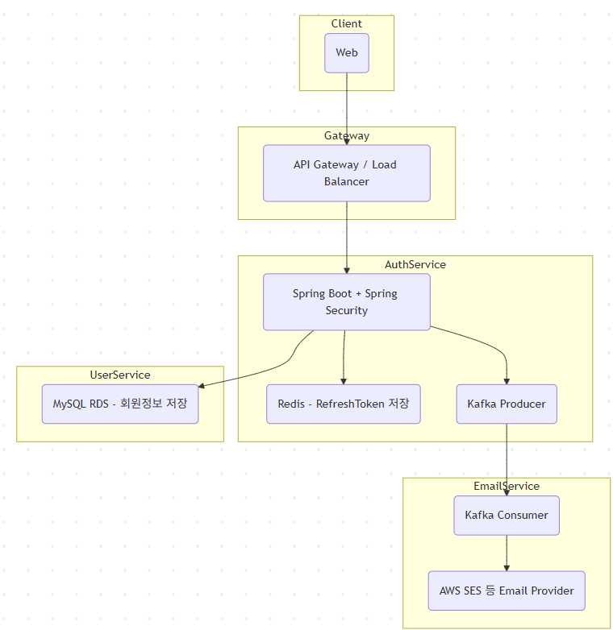
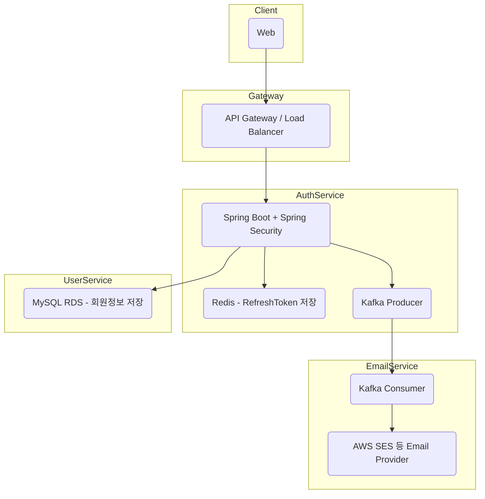

# 시스템 아키텍처 설계서 - user-auth-service (v1.0)

---

## 1. 시스템 개요

본 시스템은 사용자 인증 및 권한 관리를 담당하는 인증 서비스입니다.  
회원가입, 로그인, OAuth2 소셜 로그인, 토큰 기능, 비밀번호 관리, 이메일 인증, 복안 정책, 확장성을 모두 고백하여 설계되어있습니다.

---

## 2. 시스템 아키텍처 구성도

---

## 3. 콤포넌트 상세 설명

| 콤포넌트 | 설명 |
|--|--|
| Client | 웹/모바일 클라이언트, SPA 기반 (Vue) |
| API Gateway / Load Balancer | HTTPS 인증, 로드밸런싱, 라우팅 |
| Auth Service | Spring Boot 기반 인증 API 서버 |
| Redis | RefreshToken 관리, 세션 상태 캐싱 |
| Kafka | 비동기 이벤트 전달 (이메일 인증, 검사로그 등) |
| User Service | 사용자 정보 저장 및 관리 (MySQL) |
| Email Service | Kafka Consumer → 이메일 발송 |
| Email Provider | AWS SES, SendGrid 등 외부 이메일 서비스 |

---

## 4. 인증 및 보안 설계

### 4.1 인증 방식
- JWT 기반 Stateless 인증
- OAuth2 소셜 로그인 (Google, Kakao, Naver)
- 이메일 인증 (6자리 코드, 유효시간 5분)

### 4.2 토큰 정책
- Access Token: 1시간
- Refresh Token: 14일
- Access Token 만료 5분 전 자동 갱신
- 로그아웃 시 Refresh Token 삭제

### 4.3 비밀번호 정책
- 최소 8자, 영문+숫자+특수문자 조합
- BCrypt 해싱

### 4.4 보안 정책
- CSRF: API는 비활성화, 관리콘솔은 활성화
- XSS 방어: 입력 검정 및 출력 인코딩
- HTTPS: 전 구간 적용 (AWS ACM)
- OAuth2: state 파라미터 및 PKCE 적용 고려

---

## 5. 확장성 및 장애 대응

- Redis 장애시 자동 Failover (ElastiCache Cluster Mode)
- Kafka 기반 비동기 아키텍처 (비동기 이벤트 처리)
- Auth Service ↔ User Service 마이크로서비스 분리 구조
- Blue/Green 무중단 배포 지원 (EC2 or EKS 기능)
- DB 장애 발생 시 읽기 전용 모드 전환 및 Failover 고려
- kafka 장애 시 동기 처리 fallback 적용 가능
- 토큰 검증 실패 시 재로그인 유도 처리

---

## 6. 성능 및 용량 설계

### 6.1 예상 트래픽 및 사용자 수

- 예상 일일 사용자 수: 100만명
- 최대 TPS 목표: 1,000 TPS (로그인/토큰 발급 기준)

### 6.2 API 서버 확장성

- Stateless 구조 → 수평 확장 가능
- EC2 m6i.large 기준 1대당 약 100 TPS 처리 가능
- 초기 10대 서버 → 1,000 TPS 안정 처리
- Auto Scaling 그룹 적용으로 2,000 TPS까지 확장 가능

### 6.3 DB 설계

- MySQL RDS Multi-AZ 구성
- Read Replica 분리로 읽기 부하 분산
- Connection Pool: HikariCP 사용 (maxPoolSize: 50, minimumIdle: 10)

### 6.4 Redis 용량 계획

- 동시 활성 사용자 10% 가정: 약 10만 Refresh Token
- 1건당 약 512 Byte → 약 50~100MB 필요
- Redis ElastiCache 1~2GB 사양으로 충분히 커버 가능

### 6.5 Kafka 설정

- Topic: email-verification
- Partition: 3~5개 설정 → 수백 TPS 커버 가능

### 6.6 장애 대응 성능 요약

- API 서버: 무중단 확장성 확보 (Auto Scaling)
- DB: Failover 및 Replica 활용
- Kafka: 비동기 전송 실패 시 재시도 및 fallback 지원
- Redis: Cluster Mode + 자동 Failover 적용

---

## 7. 운영 및 모니터링

| 영역 | 적용 기술 |
|--|--|
| CI/CD | GitHub Actions |
| 배포 | Docker, AWS EC2 (EKS 확장 가능성) |
| 로깅 | ELK Stack (Elasticsearch, Logstash, Kibana) |
| 모니터링 | Prometheus + Grafana |
| 알림 | Slack, CloudWatch 연동 |
| 헬스체크 | Spring Boot Actuator 기반 /healthz 엔드포인트 제공

---

## 8. 전체 기술 스택 요약

| 영역 | 기술 |
|--|--|
| Backend | Spring Boot 3.x, Spring Security 6.x |
| Auth | JWT, OAuth2 Client |
| Messaging | Kafka (MSK) |
| Cache | Redis (ElastiCache) |
| Database | MySQL (RDS) |
| Deployment | Docker, AWS EC2 |
| API Docs | springdoc-openapi |
| Language | Java 17 |

---

## 9. 향후 확장 고려사항

- 관리자 콘솔 별도 분매 개발
- 알림 서비스 고도화 (SMS, WebPush 연동 등)
- 추가 소셜 로그인 공급자 연동
- 장애 대응 자동화 시뮬레이션 (Chaos Engineering)
- 클라우드 멀티존 확장 대응

# [마침]

